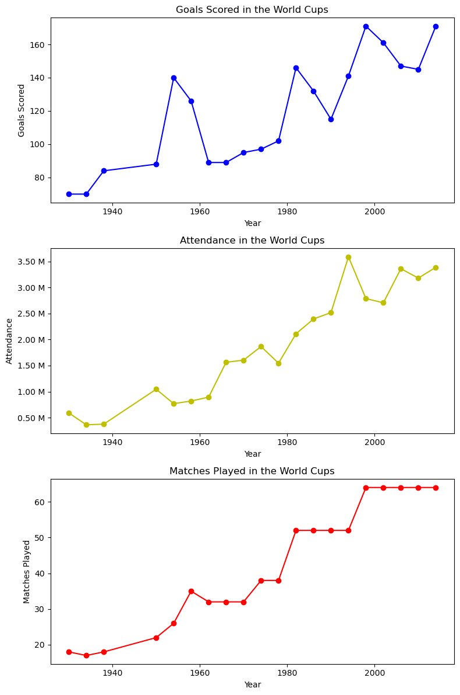
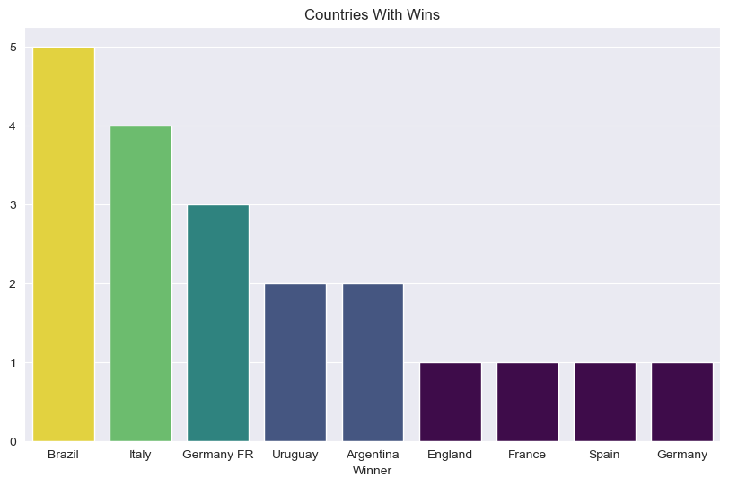
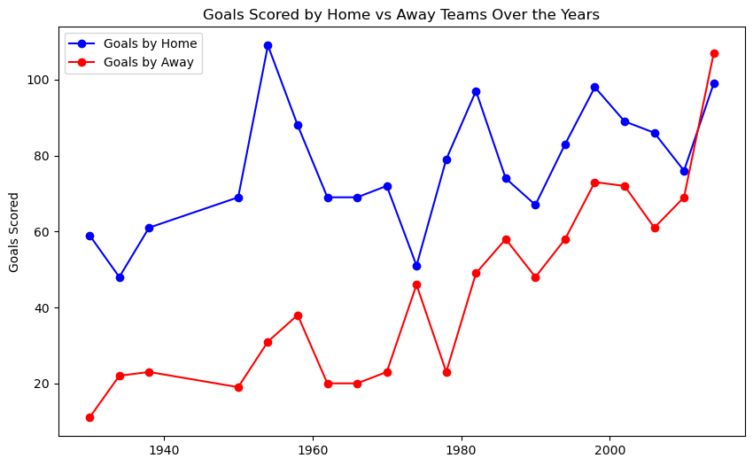
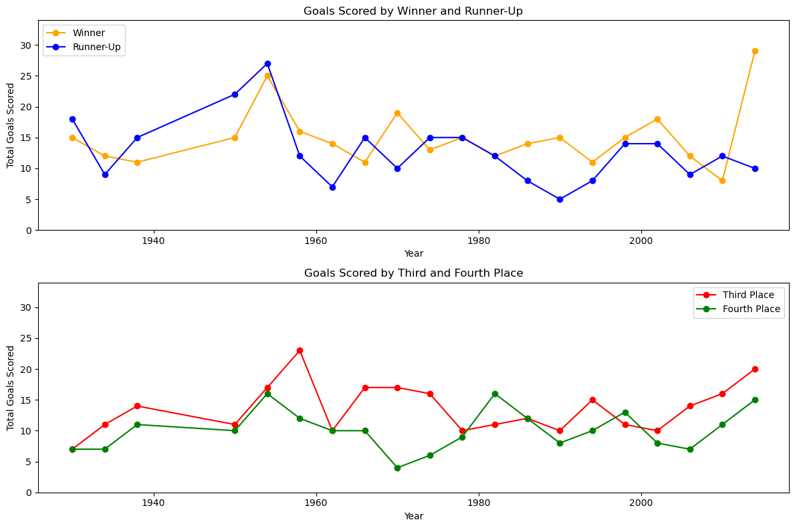
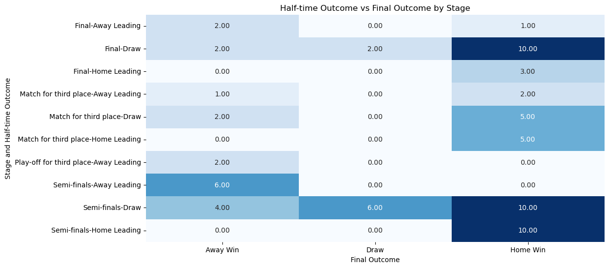
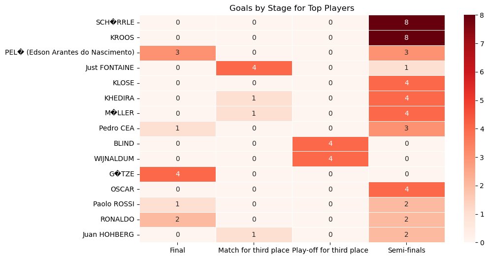
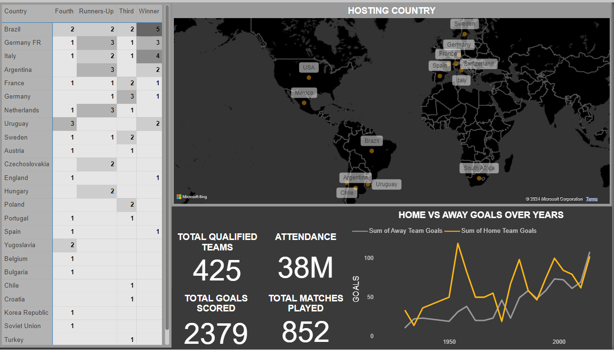
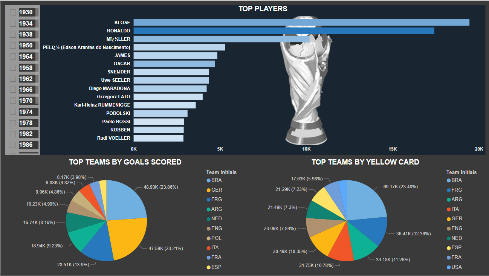
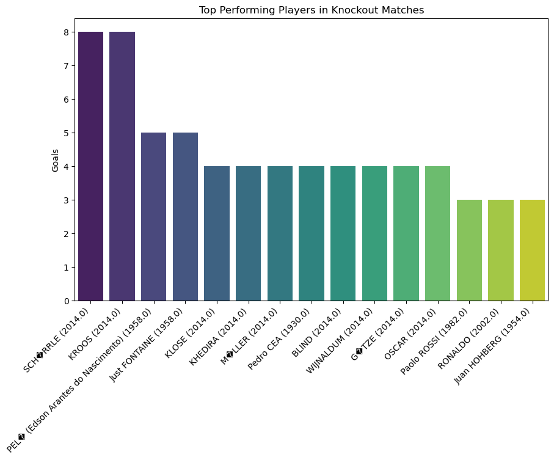

# FIFA World Cup Analytics

## Overview
This project analyzes historical FIFA World Cup data to uncover key metrics and factors influencing the outcomes of the tournaments. The analysis was conducted using Python, with a focus on providing valuable insights into what contributes to a team's success in the World Cup.

## Objective
The main objective is to identify the key metrics and factors that influence World Cup victories by analyzing datasets that include comprehensive information about all World Cups and match results.

## Table of Contents
- [Introduction](#introduction)
- [Methodology](#methodology)
  - [Data Preparation](#data-preparation)
  - [KPI Identification](#kpi-identification)
  - [Advanced Analysis](#advanced-analysis)
  - [Winner Prediction](#winner-prediction)
- [Power BI Dashboard](#power-bi-dashboard)
- [Key Findings](#key-findings)
- [Conclusion](#conclusion)
- [Acknowledgments](#acknowledgments)

## Introduction
The FIFA World Cup is the world's most prestigious football competition, contested every four years. This project tackles the challenge of identifying the key metrics and factors that influence World Cup victories.


## Methodology

### Data Preparation
- **Loading Data**: Imported and merged World Cup-related datasets in Python for comprehensive analysis.
- **Exploratory Data Analysis (EDA)**:
  - **Data Cleaning**: Removed inconsistencies, handled missing values, and formatted data for analysis.
  - **Trend Analysis**:
    - **Attendance Trends**: Examined changes in audience attendance over the years.
    - **Number of Matches**: Analyzed the increase or decrease in the number of matches per World Cup.
    - **Goals Scored**: Tracked goal-scoring trends across different World Cups.
    ```python
    import matplotlib.pyplot as plt
    from matplotlib.ticker import FuncFormatter


    def millions_formatter(x, pos):
        return f'{x:.2f} M'

    attendance_trend_modified=attendance_trend.copy()
    attendance_trend_modified['Attendance']=attendance_trend_modified['Attendance']/1000000
    # Creating subplots to visualize the trends
    fig, axes = plt.subplots(3, 1, figsize=(8, 12))

    # Plotting Goals Scored trend
    axes[0].plot(goals_trend.index, goals_trend['GoalsScored'], marker='o', color='b')
    axes[0].set_title('Goals Scored in the World Cups')
    axes[0].set_xlabel('Year')
    axes[0].set_ylabel('Goals Scored')


    # Plotting Attendance trend
    axes[1].plot(attendance_trend_modified.index, attendance_trend_modified['Attendance'], marker='o', color='y')
    axes[1].set_title('Attendance in the World Cups')
    axes[1].set_xlabel('Year')
    axes[1].set_ylabel('Attendance')
    axes[1].yaxis.set_major_formatter(FuncFormatter(millions_formatter))


    # Plotting Matches Played trend
    axes[2].plot(matches_trend.index, matches_trend['MatchesPlayed'], marker='o', color='r')
    axes[2].set_title('Matches Played in the World Cups')
    axes[2].set_xlabel('Year')
    axes[2].set_ylabel('Matches Played')


    plt.tight_layout()
    plt.show()
    ```
 

    
  - **Winner Analysis**: Identified winning teams and plotted the number of trophies won by each team over the years.

  

### KPI Identification
- **Home vs. Away Team Goals**: Analyzed the trend in goals scored by home and away teams throughout different World Cups.


- **Top Teams Comparison**: Compared the goals scored by the top 4 teams in each year to determine consistent performers.



### Advanced Analysis
- **Comeback Situations**: Investigated matches where teams came from behind to win or draw, highlighting significant comeback stories.


*Heat Map showing how many times half-time leading teams lose, creating great comebacks by other teams.*
- **Top Performing Players in Knockout Matches**: Identified players who excelled in crucial knockout stages by analyzing goals scored in these high-pressure matches.


*Heat map Showing top performing players in knockout matches over years.*

## Winner Prediction
- **Modeling Techniques**: Applied Logistic Regression, Gradient Boosting, and Random Forest classifiers to predict World Cup winners.
- **Best Model**: The Random Forest Classifier showed the highest accuracy in predicting winners.

```python
from sklearn.ensemble import RandomForestClassifier
from sklearn.metrics import classification_report, accuracy_score

# Train Random Forest Classifier
model = RandomForestClassifier(n_estimators=100, random_state=42)
model.fit(X_train, y_train)

# Make predictions
y_pred = model.predict(X_test)

# Evaluate model
print("Accuracy:", accuracy_score(y_test, y_pred))
print("Classification Report:\n", classification_report(y_test, y_pred))

from sklearn.model_selection import GridSearchCV

# Define parameter grid for Random Forest
param_grid = {
    'n_estimators': [100, 200],
    'max_depth': [10, 20],
    'min_samples_split': [2, 5]
}

grid_search = GridSearchCV(estimator=RandomForestClassifier(random_state=42), param_grid=param_grid, cv=3)
grid_search.fit(X_train, y_train)

print("Best Parameters:", grid_search.best_params_)

```

| Model                    | Accuracy | Support |
|--------------------------|----------|---------|
| Logistic Regression       | 0.89     | 169     |
| Random Forest Classifier  | 0.99     | 169     |
| Gradient Boosting         | 0.95     | 169     |

## Power BI Dashboard
The Power BI dashboard includes:
- **General Stats**: Visualizations of trends in attendance, matches played, goals scored, comparison of goals scored by home teams and away teams over the years, and top teams over the years.


- **Top Players and Teams**: Focused on individual player performances, highlighting top goal scorers and top teams based on goals and yellow cards.



## Key Findings

### Trend Analysis
- **Attendance**: Attendance has generally increased over the years, reflecting growing global interest.
- **Matches and Goals**: Both the number of matches and goals scored have fluctuated, with recent tournaments seeing higher goal tallies.
- **Consistent Winners**: Teams like Brazil, Italy, and Germany consistently perform well, often reaching the final stages.

### KPI Analysis
- **Home Advantage**: Home teams tend to score more goals, but away teams have increasingly performed better over the years.
- **Semi-Finals Qualifying Teams**: Recent years have seen winner teams outperform everyone in terms of goals scored, particularly Germany.

### Advanced Analysis
- **Comeback Matches**: Identified iconic matches where teams overturned significant deficits, underscoring the unpredictability of the knockout stages.Percentage of knockout matches where the half-time leading team wins is only 39.73% and where it was draw is 10.96.

- **Top Players**: Highlighted key players who have consistently performed in knockout stages, making them pivotal to their teams' success, such as André Schürrle and Toni Kroos with 8 goals each in 2014 knockouts.



## Conclusion
The analysis provides valuable insights into the factors influencing World Cup success and demonstrates the power of data in understanding and predicting outcomes in football. The work of data analysts is crucial in uncovering these insights, helping fans and teams alike to better understand the dynamics of the game.

## Acknowledgments
- **Author**: Akash Tewari
- **Mentor**: Unified Mentor
